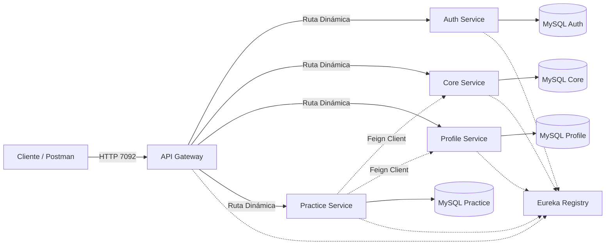

# Entregable Unidad 1 - Sistema Distribuido Base

## 3. Producto esperado
Se presenta un sistema base distribuido orientado a producción compuesto por 4 microservicios funcionales integrados a una infraestructura con configuración centralizada, registro de servicios y API Gateway, listo para pruebas de escalamiento y validación funcional.

---

## 4. Datos del sistema presentado
### 4.1 Nombre del sistema
Sistema de Gestión de Prácticas Pre-Profesionales (Migración a Microservicios).

### 4.2 Problema o necesidad que atiende
El sistema monolítico anterior presentaba un alto acoplamiento en base de datos y dificultad para escalar componentes críticos. Este sistema desacopla la gestión de usuarios, empresas y estudiantes, permitiendo su evolución y escalamiento independiente sin romper la lógica del negocio.

### 4.3 Microservicio desarrollado
Se implementaron y orquestaron 4 microservicios centrales:
- `auth-service`
- `core-service`
- `profile-service`
- `practice-service`

### 4.4 Responsabilidad del microservicio
Tomando como caso de estudio el `practice-service`:
- **Qué gestiona:** Planes de Prácticas de estudiantes en las empresas.
- **Qué datos administra:** Objetivos, actividades, fechas, estado del plan (DRAFT, APPROVED).
- **Qué operaciones ofrece:** CRUD para los planes de prácticas y la integración de información externa.
- **Qué no le corresponde hacer:** No gestiona contraseñas, ni perfiles de alumnos, ni rucs de empresas. Confía esa información a los otros microservicios (a través de Feign).

---

## 5. Arquitectura implementada
### 5.1 Componentes utilizados
- [X] Config Server y Config Repo
- [X] Registry Server (Eureka)
- [X] API Gateway
- [X] Microservicios (4)
- [X] Base de datos del microservicio (1 para cada servicio)
- [X] Docker / Docker Compose
- [X] Perfiles o entornos (`dev`, `prod`)
- [X] Preparación para múltiples instancias

### 5.2 Diagrama de arquitectura


### 5.3 Explicación de la arquitectura
El cliente hace peticiones al **Gateway**, que las enruta hacia los microservicios usando **Eureka** como mapa de servicios disponibles. Cada microservicio maneja su propia base de datos (MySQL). Las configuraciones se extraen centralizadamente del **Config Server**.

### 5.4 Justificación técnica
Representa una base orientada a producción porque elimina el punto único de fallo monolítico. Si el módulo de "Prácticas" colapsa por tráfico, los usuarios podrán seguir usando la gestión de "Auth" o "Profile". Además, habilita escalamiento independiente por contenedores.

---

## 6. Configuración externa
### 6.1 Estrategia aplicada
Se implementó un servidor `config-server` que lee variables y propiedades desde un repositorio local `config-repo`, el cual inyecta la configuración en tiempo de arranque a cada microservicio dependiendo de su entorno.

### 6.2 Entornos definidos
- `dev` (Desarrollo local híbrido)
- `prod` (Producción full-Docker)

### 6.3 Diferencias entre entornos
- **Puertos:** `dev` levanta en puertos expuestos (8081, etc), `prod` levanta encapsulado en Docker.
- **Base de datos:** `dev` apunta a `localhost:338X`, mientras que `prod` apunta al nombre de contenedor en la red Docker (`mysql-auth:3306`).
- **Eureka Url:** `dev` apunta a localhost, `prod` usa alias de red (`http://registry-server:7081`).

### 6.4 Evidencias
*(Adjuntar capturas del config-repo con `auth-service-dev.yml` y `auth-service-prod.yml`)*.

### 6.5 Reflexión
- **¿Por qué separar configuración?** Permite que un mismo `.jar` funcione en Dev y Prod sin recompilar.
- **Riesgos de hardcodear:** Una fuga de credenciales o la obligación de bajar el sistema solo para cambiar la IP de una BD.

---

## 7. Registro y descubrimiento de servicios
### 7.1 Registro del microservicio
Se incluyó `spring-cloud-starter-netflix-eureka-client`. Cada microservicio se conecta al `registry-server` enviando pulsos (heartbeats).

### 7.2 Nombre lógico del servicio
- `AUTH-SERVICE`, `CORE-SERVICE`, `PROFILE-SERVICE`, `PRACTICE-SERVICE`.

### 7.4 Reflexión
- **¿Qué ventaja aporta?** Evita hardcodear IPs estáticas. Si un servicio cambia de máquina, Eureka informa su nueva ubicación dinámicamente.

---

## 8. Exposición mediante API Gateway
### 8.1 Rol del Gateway
Centraliza todas las peticiones externas en un único punto de entrada (puerto `7091/7092`), ocultando la red privada interna.

### 8.2 Rutas publicadas
- **GET, POST, PUT, DELETE** -> `/api/v1/auth/**` -> Ruteado a `AUTH-SERVICE`
- **GET, POST, PUT, DELETE** -> `/api/v1/core/**` -> Ruteado a `CORE-SERVICE`
- **GET, POST, PUT, DELETE** -> `/api/v1/profile/**` -> Ruteado a `PROFILE-SERVICE`
- **GET, POST, PUT, DELETE** -> `/api/v1/practice/**` -> Ruteado a `PRACTICE-SERVICE`

### 8.4 Reflexión
- **¿Por qué acceder por Gateway?** Facilita la implementación futura de seguridad (JWT central), limitación de tasa (Rate Limiting) y evita Cross-Origin en frontends.

---

## 9. Preparación para múltiples instancias
### 9.1 Estrategia de escalado inicial
Se configuró cada servicio en Docker Compose (`docker-compose.yml` en Prod) sin forzar un mapeo de puertos estático en el host, permitiendo levantar N réplicas con `docker compose up --scale practice-service=3`.

### 9.3 Reflexión
- **Escalabilidad en producción:** Permite soportar picos de peticiones. Si 500 alumnos suben su plan a la vez, se clona el servicio temporalmente.

---

## 10. Diseño funcional del microservicio
### 10.1 Entidad o proceso principal
La Entidad `Plan` en `practice-service`.

### 10.2 Endpoints principales
- **GET** `/api/v1/practice/plans/{id}` (Obtiene el Plan + Fetchea la Empresa y Alumno).
- **POST** `/api/v1/practice/plans` (Crea el Plan de Prácticas).

### 10.3 Estructura de datos principal
`studentId` (Long), `companyId` (Long), `objectives` (String), `status` (Enum: DRAFT/APPROVED).

### 10.4 Validaciones implementadas
Spring Validation (`@NotBlank`, `@NotNull`) para proteger la integridad del `studentId` y campos requeridos antes de guardar en la BD.

---

## 11. Persistencia y operación básica
### 11.1 Base de datos utilizada
4 bases de datos MySQL separadas y dedicadas (`db_auth`, `db_core`, `db_profile`, `db_practice`).

### 11.2 Gestión del esquema
Mediante Hibernate JPA `ddl-auto: update`, que genera las tablas automáticamente al arrancar.

### 11.4 Reflexión
- **Persistencia propia:** Si comparten base de datos, un cambio de tabla en `core-service` rompería a `practice-service`. La independencia asegura verdadero desacoplamiento.

---

## 12. Despliegue y ejecución
### 12.1 Ejecución en desarrollo
Bases de datos en contenedores Docker y servicios inicializados con `mvn spring-boot:run` desde consola, facilitando hot-reload y depuración de código.

### 12.2 Ejecución en entorno productivo
Orquestación completa utilizando `docker-compose.yml` donde servicios, gateway y registro operan dentro de una red aislada (`ms-net`), comunicándose por nombres lógicos de host.

### 12.3 Requisitos previos
- **Java:** JDK 17
- **Gestor:** Maven
- **Contenedores:** Docker, Docker Compose

### 12.4 Comandos principales
```bash
# Desarrollo:
docker compose -f docker-compose-dev.yml up -d
mvn spring-boot:run -Dspring-boot.run.profiles=dev

# Producción:
mvn clean package -DskipTests
docker compose up -d --build
```

---

## 13. Repositorio, rama y Pull Request
### 13.1 Repositorios asociados
- https://github.com/steps4devs/PPPsforMS.git

### 13.2 Evidencia de versionamiento
- Rama `main` / Commit `feat(microservices): migración exitosa de CRUDs y OpenFeign`

### 13.3 Descripción del aporte
Se migró la lógica a 4 microservicios integrados a Infraestructura Cloud usando OpenFeign.

### 13.4 Reflexión sobre flujo de trabajo
Garantiza calidad del código y evita disrupciones en el sistema funcionando mediante revisiones por pares.

---

## 14. Validación funcional
### 14.2 Caso de validación integral
1. Se crea Perfil de Estudiante y Empresa vía APIs respectivas.
2. Se hace POST al Gateway `/api/v1/practice/plans` enviando los IDs.
3. El microservicio de Prácticas almacena los datos y usa OpenFeign para ensamblar el `PlanResponseDto` retornando toda la información agrupada.

---

## 15. Problemas encontrados y solución aplicada
- **Problema:** Fallo al levantar bd en profile-service con error `Access denied`.
- **Causa:** Desincronización de credenciales entre docker-compose (`root`) y config-repo (vacío).
- **Solución:** Cambio a `MYSQL_ALLOW_EMPTY_PASSWORD: 'yes'` y limpieza de volúmenes obsoletos (`down -v`).

---

## 16. Análisis y reflexión
Entendí que migrar a microservicios no es copiar el código; requiere orquestar comunicaciones de red y gestionar la configuración para no hardcodear la infraestructura.

---

## 17. Conclusiones
Se logró un ecosistema Spring Cloud completo, 100% capaz de escalar mediante contenedores e integrado con Eureka y Gateway.

---

## 18. Proyección a la Unidad 2
- Incorporación de **Spring Security JWT**.
- **Resilience4j** (Circuit Breaker) para evitar la latencia generada por servicios apagados al invocar OpenFeign.

---

## 19. Tabla de evidencias
*(Marcar todos los checks con "Sí" en la rúbrica).*
